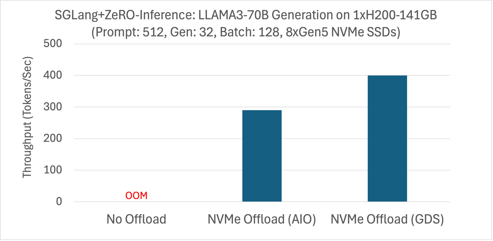
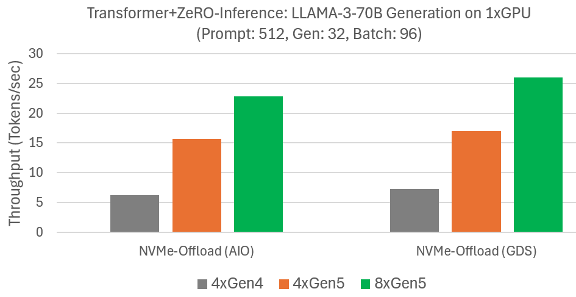
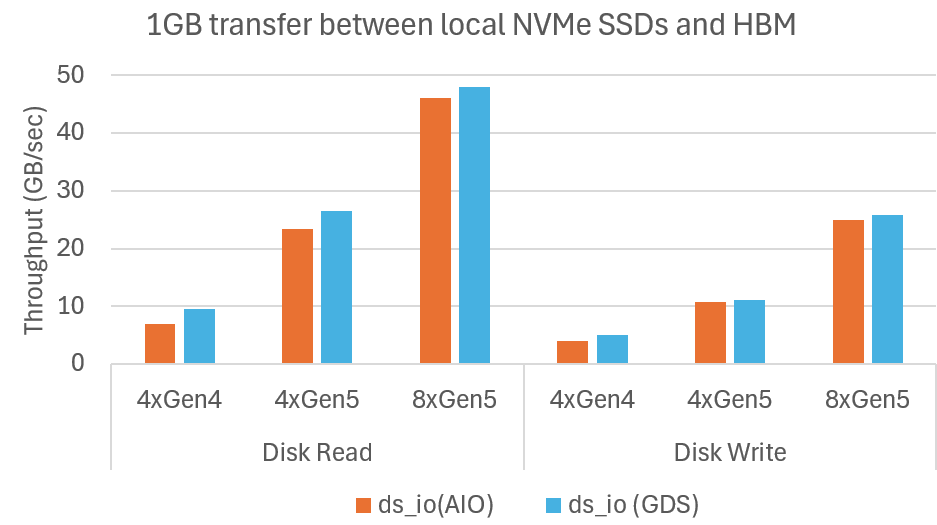

<div align="center">

# DeepNVMe: Affordable I/O scaling for Deep Learning Applications.

</div>

# Introduction
We introduced [DeepNVMe](https://github.com/deepspeedai/DeepSpeed/blob/master/blogs/deepnvme/08-2024/README.md) in summer 2024 as a suite of optimizations for tackling I/O bottlenecks in Deep Learning (DL). DeepNVMe delivers significant speedups for I/O bound DL workloads by leveraging storage innovations including local NVMe SSDs, NVIDIA Magnum IO<sup>TM</sup> GPUDirect® Storage (GDS), and Linux Asynchronous I/O (AIO).
In this update, we are delighted to announce DeepNVMe improvements on multiple fronts: (i) expanding application coverage to FastPersist model checkpointing and SGLang inference, (ii) I/O performance scaling by upgrading from PCIe Gen4 to Gen5 NVMe SSDs, and (iii) expanding usability to CPU-only environments, offset-based I/O operations, and tensor data type casting. The results reported in this blog are available in DeepSpeed versions >= [0.17.1](https://github.com/deepspeedai/DeepSpeed/releases/tag/v0.17.1).

# Evaluation environments
Our experiments are conducted on Azure [ND-H200-v5](https://learn.microsoft.com/en-us/azure/virtual-machines/sizes/gpu-accelerated/nd-h200-v5-series?tabs=sizebasic) VM. The key software configurations are summarized in the following table.

|Software | Version
|---|--|
|Ubuntu | 24.04.2|
|PyTorch | 2.6.0|
|CUDA | 12.6 |
SGLang | 0.4.4.post4 |

# Addressing I/O Bottlenecks of Deep Learning
We used DeepNVMe to develop FastPersist and ZeRO-Inference to target I/O bottlenecks in DL training and inference respectively. Our experiments are conducted using a single VM, in which we combine the available NVMe SSDs into a single RAID-0 (i.e., disk striping) volume to leverage aggregate read and write bandwidths. Since DeepNVMe can offload tensors using CPU bounce buffers (a.k.a., AIO), or NVIDIA GPUDirect Storage (a.k.a., GDS), we report results for both modes.

## FastPersist: Faster Model Checkpoint Creation
Although saving model checkpoints to persistent storage is critical in model training, it is also a major bottleneck due to the inefficiencies of existing approaches. We developed [FastPersist](https://arxiv.org/abs/2406.13768) to address the performance challenges of checkpointing. FastPersist makes checkpointing overheads negligible during training through three key techniques: (i) DeepNVMe, (ii) data parallelism, and (iii) overlapping I/O and computation.

Our goal here is to demonstrate the impact of DeepNVMe in FastPersist using single-process micro-benchmarks (available [here](https://github.com/deepspeedai/DeepSpeedExamples/tree/master/deepnvme/model_checkpoint)) which serialize a model checkpoint state from HBM to local NVMe. We use the popular PyTorch `torch.save()` as the baseline in our experiments, and integrate FastPersist into `torch.save()` to simplify adoption and performance comparisons.

### Faster Saving of PyTorch Models to local NVMe Storage
We measure the throughput of serializing Phi-3-Mini checkpoint state from HBM to local NVMe storage. The results are summarized in the Figure below. We observe significantly faster checkpointing with FastPersist compared to the baseline. We see speedups of over 20X in the 8xGen5 NVMe settings. We also observe FastPersist scaling with increased NVMe bandwidth of 8xGen5 compared with 4xGen5.


<div align="center">
  FastPersist provides significantly faster model checkpointing to local NVMe.
</div>

## ZeRO-Inference: Democratizing Generative AI
[ZeRO-Inference](https://github.com/deepspeedai/DeepSpeedExamples/blob/master/inference/huggingface/zero_inference/README.md) is a technology that democratizes access to state-of-the-art models by reducing the GPU costs of model inference. ZeRO-Inference enables inference computations of massive models (hundreds-of-billions of parameters) on as few as one GPU by offloading the model weights to DRAM and NVMe storage. ZeRO-Inference is designed for offline or throughput-oriented inference scenarios. In this blog, we share two updates on ZeRO-Inference. First, we have integrated ZeRO-Inference into SGLang, a state-of-the-art model serving framework. Second, we observed ZeRO-Inference performance scales with the faster NVMe SSDs in the latest Azure SKUs.

### Democratizing SGLang through ZeRO-Inference integration
[SGLang](https://docs.sglang.ai/) is a state-of-the-art serving framework for large language models (LLMs) and vision language models (VLMs). Our integration of ZeRO-Inference into SGLang makes SGLang available to budget-constrained users, and offers a cost-reduction option to existing SGLang users. We used SGLang's [offline benchmarking tool](https://github.com/sgl-project/sglang/blob/main/python/sglang/bench_offline_throughput.py) to measure the generation throughput of LLAMA3-70B on a single H200 with NVMe offloading (LLAMA3-70B cannot fit in the 141GB VRAM without offloading). The experiment is configured with prompt length of 512, generation length of 32, and batch size of 128. We summarize the results in the figure below for both AIO and GDS offloading.


<div align="center">
  ZeRO-Inference improves SGLang inference with NVMe offloading to reduce hardware costs.
</div>


### Scaling HF Transformer Generation with Faster NVMe SSDs
ZeRO-Inference enhances HF Transformer inference with efficient model offloading to DRAM or NVMe. We previously [evaluated](https://github.com/deepspeedai/DeepSpeed/blob/master/blogs/deepnvme/08-2024/README.md#high-performance-offloading-via-nvme-scaling) LLAMA-3-70B generation performance with NVMe offloading on a single GPU and four Gen4 NVMes in an Azure [NC_A100_v4](https://learn.microsoft.com/en-us/azure/virtual-machines/sizes/gpu-accelerated/nca100v4-series?tabs=sizebasic) VM. We measured the generation speed for a prompt of 512 tokens, output of 32 tokens, and batch size 96. Since NVMe bandwidth was the main bottleneck, we repeat the experiments on Azure ND-H200-v5 offering Gen5 NVMes. The results summarized in the Figure below show that ZeRO-Inference uses the increased NVMe bandwidths to improve generation speeds. For example, with GDS, generation speed improves from 7 tokens/sec with four Gen4 NVMes to 17 tokens/sec with four Gen5 NVMes, and further to 26 tokens/sec with eight Gen5 NVMes. We observe similar improvements without GDS. These results show that ZeRO-Inference performance can be improved in cost-effective manner by increasing NVMe bandwidths.


<div align="center">
  ZeRO-Inference leverages available NVMe bandwidth to scale LLAMA-3-70B generation.
</div>


# I/O performance scaling
We used our `ds_io` benchmarking tool to demonstrate DeepNVMe proportionally scaling I/O performance with available NVMe bandwidths. This empowers users to accelerate I/O bound DL applications at modest cost using more or faster NVMe SSDs. In our experiments, we measure the achieved read and write bandwidths of 1GB data transfers between HBM and NVMes. We evaluate scaling up NVMes from PCIe Gen4 to Gen5, and scaling out from 4 to 8 SSDs. The SSDs are combined into a single RAID-0 (disk striping) volume. We summarize the results in the Figure below which show that DeepNVMe scales I/O performance on both dimensions. Scaling up from 4xGen4 SSDs to 4xGen5 SSDs improves reads from 10GB/sec to 27GB/sec, and writes from 5GB/sec to 11GB/sec. Scaling out from 4xGen5 to 8xGen5 further improves reads to 48GB/sec, and writes to 26GB/sec.


<div align="center">
  Microbenchmark shows DeepNVMe scales I/O performance with available NVMe bandwidth
</div>


# Broadening usability
We have increased the usage scenarios of DeepNVMe by removing restrictions regarding hardware environments and I/O operations, as explained below.

## CPU-Only environments
Although GPUs (and similar accelerators) dominate DL, CPUs are still used in important machine learning (ML) workloads such as recommendation systems. However, DeepNVMe was previously unusable in CPU-only environments. This was because DeepNVMe relied on `torch.pin_memory()` for page-locked CPU tensors, whereas `torch.pin_memory()` does not work in the CPU versions of `torch` as illustrated below.

```bash
>>> import torch
>>> torch.__version__
'2.6.0+cpu'
>>> x = torch.empty(1024).pin_memory()
Traceback (most recent call last):
  File "<stdin>", line 1, in <module>
RuntimeError: Cannot access accelerator device when none is available.
>>>
```

We have made DeepNVMe usable in CPU environments by adding mechanisms for allocating (`new_cpu_locked_tensor()`) and releasing (`free_cpu_locked_tensor()`) page-locked CPU tensors. The snippet below illustrates allocating a pinned CPU tensor (`x`).

```bash
>> import torch
>>> torch.__version__
'2.6.0+cpu'
>>> from deepspeed.ops.op_builder import AsyncIOBuilder
>>> h = AsyncIOBuilder().load().aio_handle()
>>> x = h.new_cpu_locked_tensor(1024, torch.Tensor())
>>> x.shape
torch.Size([1024])
>>> x.dtype
torch.float32
```

## Offset-based I/O operations
Previously, DeepNVMe functionality was restricted to reading or writing the entire contents of a file. We have now improved DeepNVMe to read or write a user-specified portion of file content from a given offset. In particular, we have extended the existing read/write APIs to accept a user-specified `file offset` argument (with default value 0) such as below:

```bash
>> from deepspeed.ops.op_builder import AsyncIOBuilder
>>> help(AsyncIOBuilder().load().aio_handle().pread)
Help on method pread in module async_io:

pread(...) method of async_io.aio_handle instance
    pread(self: async_io.aio_handle, buffer: torch.Tensor, filename: str, validate: bool, async: bool, file_offset: int = 0) -> int
```


## Tensor data type casting
While developing FastPersist, we needed to manipulate model tensors, typically of floating point data types, in byte format for both performance and convenience of I/O operations. However, we could not find a zero-copy mechanism for casting tensors from arbitrary data types to a byte data type (i.e., torch.uint8), so we decided to create one. This functionality is available via the `UtilsBuilder` op as demonstrated in the example below. In the example, we cast a `torch.bfloat16` tensor into `torch.uint8`. Note that due to the zero-copy nature of the functionality, `bf16_tensor` and `byte_tensor` are aliases.

```
>>> import torch
>>> from deepspeed.ops.op_builder import UtilsBuilder
>>> util_ops = UtilsBuilder().load()
>>> bf16_tensor = torch.zeros(1024, dtype=torch.bfloat16, device='cuda')
>>> bf16_tensor
tensor([0., 0., 0.,  ..., 0., 0., 0.], device='cuda:0', dtype=torch.bfloat16)
>>> byte_tensor = util_ops.cast_to_byte_tensor(bf16_tensor)
>>> byte_tensor
tensor([0, 0, 0,  ..., 0, 0, 0], device='cuda:0', dtype=torch.uint8)
>>> bf16_tensor += 1.0
>>> bf16_tensor
tensor([1., 1., 1.,  ..., 1., 1., 1.], device='cuda:0', dtype=torch.bfloat16)
>>> byte_tensor
tensor([128,  63, 128,  ...,  63, 128,  63], device='cuda:0',
       dtype=torch.uint8)
```

# Summary
This blog post has provided updates on our continued development of DeepNVMe, an I/O optimization technology for accelerating DL applications. We have announced DeepNVMe improvements on multiple aspects, including application coverage, I/O performance scaling, and usability.

# Acknowledgements
This blog describes work done by Joe Mayer, Logan Adams, and Olatunji Ruwase of the DeepSpeed team at Microsoft.
