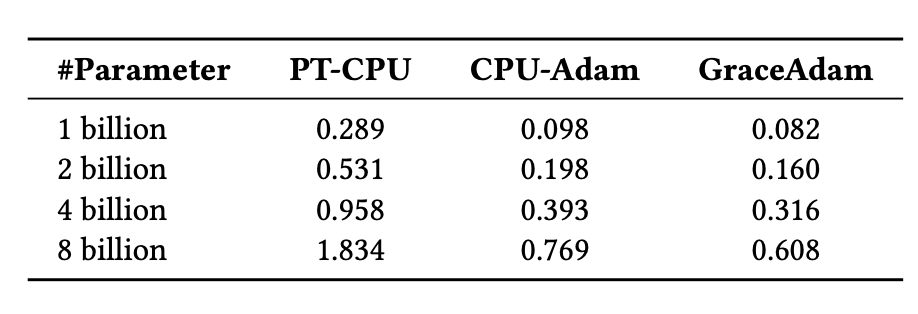

# SuperOffload: Unleashing the Power of Large-Scale LLM Training on Superchips

**Efficient full-parameter fine-tuning of GPT-OSS-20B & Qwen3-14B models on a single NVIDIA GH200 Superchip and Llama3-70B on four NVIDIA GH200 Superchips, while delivering up to 600 TFLOPS training throughput**

**Authors**
[Xinyu Lian](https://xinyulian.tech/)<sup>1</sup>, [Masahiro Tanaka](https://tohtana.github.io/)<sup>2</sup>, [Olatunji Ruwase](https://www.snowflake.com/en/blog/authors/olatunji--tunji--ruwase/)<sup>3</sup>, [Minjia Zhang](https://minjiazhang.github.io/)<sup>1</sup>

<sup>1</sup>SSAIL Lab, University of Illinois Urbana-Champaign · <sup>2</sup>Anyscale · <sup>3</sup>Snowflake

---

## Table of Content

- [SuperOffload: Unleashing the Power of Large-Scale LLM Training on Superchips](#superoffload-unleashing-the-power-of-large-scale-llm-training-on-superchips)
  - [Table of Content](#table-of-content)
  - [SuperOffload Highlights](#superoffload-highlights)
  - [Introduction](#introduction)
  - [How SuperOffload Works](#how-superoffload-works)
    - [1. Speculation-then-Validation (STV)](#1-speculation-then-validation-stv)
    - [2. Heterogeneous Optimizer Computation](#2-heterogeneous-optimizer-computation)
    - [3. Superchip-Aware Casting](#3-superchip-aware-casting)
    - [4. GraceAdam for Optimizer Efficiency](#4-graceadam-for-optimizer-efficiency)
  - [Experience and Insights](#experience-and-insights)
  - [Easy-to-Use](#easy-to-use)
  - [Acknowledgements](#acknowledgements)
  - [BibTeX](#bibtex)

## SuperOffload Highlights

- **Single GH200:** Full fine-tuning of GPT-OSS-20B, Qwen3-14B, achieving up to 600 TFLOPS (seq len 4K, batch size 4).
- **Multi-GPU:** Qwen3-30B-A3B & Seed-OSS-36B on 2× NVIDIA GH200; Llama-70B on 4× NVIDIA GH200.
- **Faster Training:** Up to 4× higher throughput compared to prior work such as ZeRO-Offload under modest settings.
- **Increased GPU Utilization:** Boost GPU utilization from ~50% to >80%.
- **Engineering & Composability:** Works with ZeRO-3 and Ulysses; operational tips (e.g., NUMA binding, MPAM) are documented in the tutorial.

---

## Introduction

The emergence of tightly coupled heterogeneous GPU/CPU architectures (a.k.a., Superchips), such as NVIDIA GH200, GB200, and AMD MI300A, offers new optimization opportunities for large-scale AI. Yet it remains under-explored in terms of how to make the best use of these new hardware for large-scale LLM training. Existing offloading solutions were designed for traditional loosely coupled architectures, and are suboptimal on Superchips suffering high overheads and low GPU utilization. To address this gap and to make the best use of Superchips for efficient LLM training, we have developed and open-sourced **SuperOffload**.

SuperOffload introduces a set of novel techniques that make the best use of Hopper GPU, Grace CPU, and NVLink-C2C, simultaneously for LLM training. Unlike prior offloading solutions which assume slow GPU-CPU interconnects (e.g., 64GB/sec for PCIe-Gen4), SuperOffload exploits the much faster interconnects (e.g., 900GB/sec for NVLink-C2C) to boost GPU and CPU utilization, and training throughput. With SuperOffload, models such as **GPT-OSS-20B**, **Qwen3-14B**, and **Phi-4** can be fully fine-tuned on a single GH200, delivering **up to 600 TFLOPS** training throughput under modest settings (sequence length 4k, batch size 4). This delivers up to **4×** higher throughput compared to prior work such as ZeRO-Offload. SuperOffload enables scaling to even larger models, including Qwen3-30B-A3B and Seed-OSS-36B on two GH200s and Llama-70B on four GH200s.

SuperOffload is built on top of DeepSpeed ZeRO Stage 3, and available in DeepSpeed versions >= [0.18.0](https://github.com/deepspeedai/DeepSpeed/releases/tag/v0.18.0). To enable easy integration into LLM finetuning pipelines, SuperOffload is compatible with Hugging Face Transformers and does not require any changes to modeling code.

<!-- Recent models, especially MoE, at the scale of tens to hundreds of billions of parameters, make fine-tuning on limited GPUs difficult. Offloading to CPU memory helps reduce GPU demand but typically assumes GPU-CPU connections over PCIe, which is bandwidth-limited (e.g., 32 GB/s on PCIe-Gen4). Thus, prior work mainly optimizes data transfers to avoid PCIe becoming a major performance bottleneck. However, hardware vendors are introducing a new class of tightly coupled architectures—such as NVIDIA GH200, GB200, and AMD MI300A—that challenge these long-standing assumptions.

The open-source release of **SuperOffload** addresses this gap by providing a set of modular techniques for efficient large-model training. With SuperOffload, models such as **GPT-OSS-20B**, **Qwen3-14B**, and **Phi-4** can be fully fine-tuned on a single GH200, achieving **600 TFLOPS** under modest settings (sequence length 4k, batch size 4). This delivers up to **4×** higher throughput compared to ZeRO-Offload. -->

<!-- Built on top of ZeRO Stage 3, SuperOffload enables scaling to even larger models, including Qwen3-30B-A3B, Seed-OSS-36B on two GH200s and Llama-70B on four GH200s. All of this is supported natively through Hugging Face Transformers and DeepSpeed, with no need for changes to modeling code. -->

<div align="center">

<p align="center"><em>Figure 1: SuperOffload delivers up to 4× higher throughput than ZeRO-Offload for large-model fine-tuning across varying sequence lengths and batch sizes, achieving up to 600 TFLOPS throughput.</em></p>
</div>

---

## How SuperOffload Works


SuperOffload consists of four composable offloading optimization techniques: (1) Speculation-then-Validation, (2) GPU/CPU Optimizer Computation, (3) Superchip-Aware Casting, and (4) GraceAdam. We provide brief descriptions of these techniques below.


### 1. Speculation-then-Validation (STV)

In most offloading solutions, synchronizations between CPU and GPU are needed in the optimizer step to ensure numerical robustness. For example, clipping the gradient norm requires calculating the global gradient norm, and mixed precision training requires a global check of NaN and INF values. These operations require the CPU to wait until all gradients have been received before the optimizer step and weight updates. STV avoids this bottleneck by breaking this dependency but still preserves the semantics of training by overlapping speculative optimizer computation on CPU with backward propagation on GPU. When gradient post-processing eventually completes, the speculative optimizer computations are either committed, discarded, or correctly replayed as appropriate. STV's post-validation of training stability enables it to safely reduce the critical path compared to prior pre-validation approaches. The figure below illustrates how SuperOffload schedules backward propagation and optimizer computation differently from traditional approaches, such as ZeRO-Offload.

<div align="center">

<p align="center"><em>Figure 2: Previous offloading approach suffers from global gradient norm and global check of NAN and INF values, which expose the optimizer step to the critical path and prevent overlapping opportunities. In SuperOffload, we introduce a speculation-then-validation schedule to address this issue.</em></p>
</div>

We evaluated the effectiveness of STV by measuring the frequency of undoing speculative optimizer computations in a pre-training run of a BLOOM-176B model. As shown in the figure below, such rollbacks (e.g., due to gradient clipping, etc.) are rare after warmup, making the associated overheads negligible over the entire training run. This makes STV practical for accelerating large-scale training.

<div align="center">

<p align="center"><em>Figure 3: Red points indicate gradient clipping triggered during BLOOM pre-training — rare after warm-up, indicating that SuperOffload's STV mechanism effectively eliminates stalls caused by gradient clipping and NaN/INF check-induced synchronizations.</em></p>
</div>

---

### 2. Heterogeneous Optimizer Computation

SuperOffload improves optimizer efficiency beyond STV by partitioning optimizer computation across GPU and CPU. The GPU is used for optimizer computations of gradients created in the latter stages of the backward pass, while the CPU handles the rest. This partitioning scheme has multiple benefits. First, the GPU avoids idly waiting for optimizer computation to complete on the CPU. Second, optimizer computation is reduced by leveraging both GPU and CPU compute. Third, GPU-CPU transfers of parameters and gradients corresponding to GPU optimizer computations can be avoided.

<!-- - Instead of waiting for all updated parameters to return from CPU, keep the optimizer states and gradients of the last few buckets in GPU memory (if HBM allows).
- Reduces synchronization bubbles and idle time between iterations.
- Parameter \(n'\) controls how many tail buckets remain on GPU. -->

---

### 3. Superchip-Aware Casting

In mixed precision training with offloading, tensor transfers between GPU and CPU require casting between the low-precision format on GPU (e.g., BF16, FP16, etc.) and the high-precision format on CPU (i.e., FP32). To address the bandwidth limitations of PCIe interconnects, prior offloading solutions transfer tensors in low-precision and type cast tensors on both GPU and CPU as appropriate. However, this is a sub-optimal strategy on Superchip architectures because GPU compute throughput is ~100X higher than CPU, and high-bandwidth interconnects (e.g., NVLink-C2C) makes the transfer costs negligible. As illustration, Figure 4 below shows that the optimal strategy on GH200 is tensor casting on the GPU and transferring in high-precision format.

<!-- - Mixed precision training involves casting tensors between low precision data types (e.g., FP16, BF16, etc.) and full precision FP32.
- On superchips with high CPU↔GPU bandwidth, casting cost matters.
- SuperOffload improves efficiency by performing casting on the GPU and sending **high-precision** tensors to the CPU. -->

<div align="center">

<p align="center"><em>Figure 4: GH200: Tensor casting to lower/higher precision on GPU and transferring in higher-precision is more efficient on Superchips.</em></p>
</div>

---

### 4. GraceAdam for Optimizer Efficiency

Existing offloading solutions for LLM training require CPU implementations of the popular Adam optimizer, such as  PyTorch Adam and DeepSpeed CPU-Adam. However, these are inadequate for Superchips because they are not optimized for the Grace CPU architecture. To address this issue, we created GraceAdam, a highly efficient Adam optimizer implementation for Grace CPUs. GraceAdam achieves high performance exploiting the underlying ARM architecture features such as Scalable Vector Extension (SVE), explicit memory hierarchy management, and instruction-level parallelism. Figure 5 below shows that on GH200 Superchip, GraceAdam is 3X faster than PyTorch Adam (PT-CPU) and 1.3X faster than CPU-Adam. To our knowledge, GraceAdam is the first open sourced Adam optimizer implementation for Grace CPU.

<div align="center">

<p align="center"><em>Figure 5: Using GraceAdam for efficient Adam optimizer computation on GH200.</em></p>
</div>


## Experience and Insights

- **NUMA Binding:**
  Pair each GPU with its directly associated CPU to maximize bandwidth. In DeepSpeed:
  ```bash
  --bind_cores_to_rank
  ```

- **MPAM (Memory System Resource Partitioning and Monitoring):**
  Reduces interference between CPU and GPU tasks.

  **How to enable MPAM on Nvidia Superchips:**
  1. Install the kernel from [NVIDIA NV-Kernels](https://github.com/NVIDIA/NV-Kernels/tree/24.04_linux-nvidia-adv-6.11).
  2. Check MPAM support:
     ```bash
     grep MPAM /boot/config-$(uname -r)
     ```
     Expected output:
     ```
     CONFIG_ARM64_MPAM=y
     CONFIG_ACPI_MPAM=y
     CONFIG_ARM64_MPAM_DRIVER=y
     CONFIG_ARM64_MPAM_RESCTRL_FS=y
     ```
     Verify resctrl filesystem:
     ```bash
     ls -ld /sys/fs/resctrl
     ```
  3. Mount resctrl:
     ```bash
     mount -t resctrl resctrl /sys/fs/resctrl
     ```
  4. Create partitions:
     ```bash
     mkdir /sys/fs/resctrl/p1 /sys/fs/resctrl/p2
     ```
  5. Set CPU cores & memory configs (example from experiments):
     ```
     /sys/fs/resctrl/p1/cpus_list:
     0-6
     /sys/fs/resctrl/p2/cpus_list:
     7-71
     /sys/fs/resctrl/p1/schemata:
     MB:1=100
     L3:1=ff0
     /sys/fs/resctrl/p2/schemata:
     MB:1=20
     L3:1=f
     ```

---

## Easy-to-Use

End-to-end finetuning examples using SuperOffload are available in our tutorial/readme: [DeepSpeedExamples: SuperOffload](https://github.com/deepspeedai/DeepSpeedExamples/tree/master/training/DeepSpeed-SuperOffload#readme). To enable SuperOffload quickly, add the following switch to your DeepSpeed config (see tutorial for full context):

<div align="center">

<p align="center"><em>Figure 5: Enable SuperOffload with a single line in the DeepSpeed config.</em></p>
</div>


Tip: On superchip platforms (e.g., GH200/GB200/MI300A), combine NUMA binding and MPAM settings from "Experience and Insights" to stabilize bandwidth and improve end-to-end performance.

<!-- ## Status & Availability

SuperOffload is open-sourced as modular extensions on top of DeepSpeed ZeRO Stage 3, and is exposed via native configuration in Hugging Face Transformers (no model code changes required).

Community feedback and contributions are welcome. For enablement and examples, see "Getting Started" above. -->

---

## Acknowledgements

This work is a close collaboration among [University of Illinois Urbana-Champaign (UIUC)](https://supercomputing-system-ai-lab.github.io/), [AnyScale](https://www.anyscale.com/), and [Snowflake](https://www.snowflake.com/en/blog/authors/snowflake-ai-research/).

We also gratefully acknowledge William Gropp, Brett Bode, and Gregory H. Bauer from the National Center for Supercomputing Applications (NCSA), as well as Dan Ernst, Ian Karlin, Giridhar Chukkapalli, Kurt Rago, and others from NVIDIA for their valuable discussions and guidance on MPAM support on Grace CPU.

Community feedback and contributions are welcome. For enablement and examples, see "Getting Started" above.

---

## BibTeX

```bibtex
@inproceedings{superoffload,
    author = {Xinyu Lian and Masahiro Tanaka and Olatunji Ruwase and Minjia Zhang},
    title = "{SuperOffload: Unleashing the Power of Large-Scale LLM Training on Superchips}",
    year = {2026},
    booktitle = {Proceedings of the 31st ACM International Conference on Architectural Support for Programming Languages and Operating System (ASPLOS'26)}
}
```
