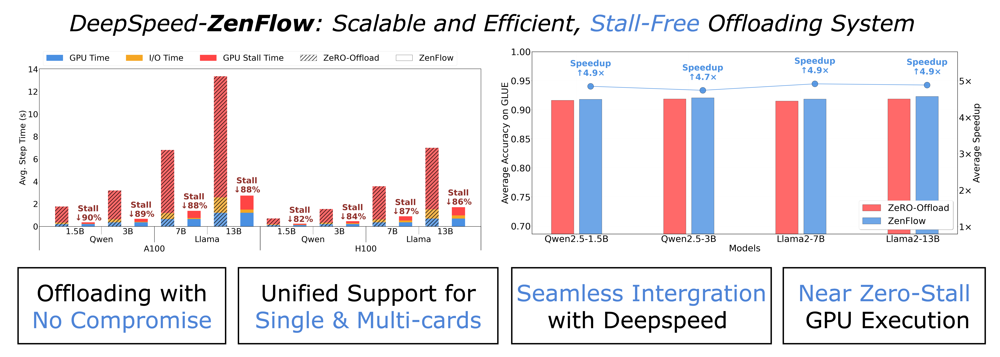
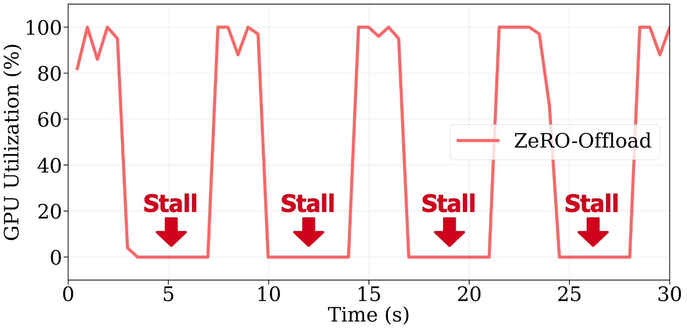
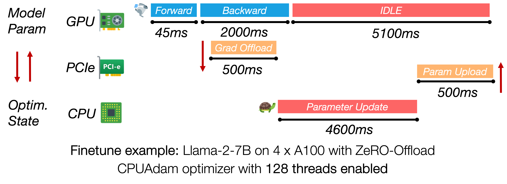
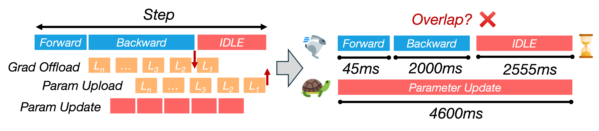
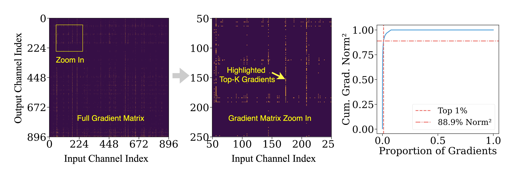
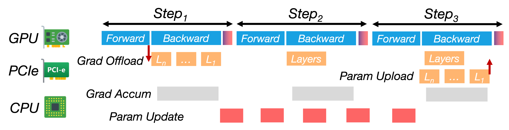

<p align="center">
  
</p>
<div align="center">

# ZenFlow: Stall-Free Offloading Engine for LLM Training

<div align="center">
  

<div align="left">


*Figure 1: ZenFlow is DeepSpeed’s stall-free offloading engine for LLM training. It decouples GPU and CPU updates by prioritizing important gradients for immediate GPU updates and deferring the rest for asynchronous CPU-side accumulation. By fully overlapping CPU work and PCIe transfers with GPU computation, ZenFlow eliminates stalls and achieves high hardware utilization across both single-GPU and multi-GPUs settings.*

## Table of Content

- [ZenFlow: Stall-Free Offloading Engine for LLM Training](#zenflow-stall-free-offloading-engine-for-llm-training)
  - [Table of Content](#table-of-content)
  - [Introduction](#introduction)
  - [ZenFlow at a Glance](#zenflow-at-a-glance)
  - [ZenFlow Highlights](#zenflow-highlights)
  - [Design Motivation](#design-motivation)
  - [ZenFlow Design](#zenflow-design)
  - [Getting Started: Try out DeepSpeed-ZenFlow](#getting-started-try-out-deepspeed-zenflow)
  - [Citation](#citation)
  - [Acknowledgements](#acknowledgements)

---

## Introduction

<div align="center">
  

<div align="left">

*Figure 2: ZeRO-Offload causes repeated GPU stalls due to blocking CPU updates and PCIe transfers, leading to >60% idle time per step when training Llama 2-7B on 4× A100s.*

Offloading has become a standard approach to scale fine-tuning of large language models (LLMs) beyond GPU memory limits. Frameworks like ZeRO-Offload reduce GPU memory usage by pushing gradients and optimizer states to the CPU. However, they also create a new bottleneck: expensive GPUs often sit idle, waiting on slow CPU updates and PCIe data transfers. In practice, enabling offloading when training Llama 2-7B on 4× A100 GPUs can inflate each step from 0.5s to over 7s—a 14× slowdown.

<div align="center">
  

<div align="left">

*Figure 3: In ZeRO-Offload, CPU-side optimizer updates and PCIe transfers dominate iteration time, leaving the GPU idle for over 5 seconds.*

**ZenFlow** addresses this bottleneck with a stall-free training pipeline. It prioritizes high-impact gradients for immediate GPU updates, while offloading the rest to the CPU and applying them asynchronously. These deferred CPU updates are fully overlapped with GPU compute, eliminating stalls and significantly improving throughput. Best of all, ZenFlow maintains the same model accuracy and integrates seamlessly with DeepSpeed.

---

## ZenFlow at a Glance

- **Zero GPU stalls:** Top-k important gradients are updated immediately on GPU; low-priority gradients are asynchronously processed on CPU—no GPU wait time.
- **Asynchronous and bounded:** ZenFlow decouples CPU and GPU execution with a bounded-staleness strategy that preserves convergence.
- **Auto-tuned:** ZenFlow adapts update intervals at runtime based on gradient dynamics—no need to tune manually.

---

## ZenFlow Highlights

ZenFlow is the **first offloading framework** to offer a **bounded-asynchronous** update scheme that preserves convergence while delivering **up to 5× end-to-end speed-up** over ZeRO-Offload.

### Performance

| Feature | Benefit |
|--------|---------|
| Up to **5×** end-to-end speed-up over ZeRO-Offload and **6.3×** over ZeRO-Infinity | Faster time-to-convergence |
| **> 85% reduction in GPU stalls** on A100 / H100 nodes | Keeps GPUs busy, higher utilization |
| **≈ 2× lower PCIe traffic** (1.13× model size per step vs. 2× in ZeRO) | Less bandwidth pressure on clusters |
| **Maintains or improves accuracy** on GLUE (OPT-350M → Llama-13B) | No accuracy loss |
| **Lightweight gradient selection** (6000× cheaper than full AllGather) | Scales to multi-GPU settings without memory footprint spikes |
| **Auto-tuning (Zen-auto)** automatically adapts update interval on-the-fly | No manual knob tuning |

For more detailed performance results, please refer to our [arXiv paper](https://arxiv.org/abs/2505.12242).

---

## Design Motivation

Training large models with offloading can save GPU memory, but often at the cost of *performance*. In this section, we briefly discuss three topics. **First**, we explain why coupling CPU-side optimizer updates with GPU compute leads to severe GPU stalls during LLM fine-tuning. **Next**, we quantify how full-gradient offloading saturates the limited PCIe bandwidth on A100/H100 servers, inflating iteration time. **Finally**, we reveal the highly skewed importance distribution of gradients, showing that uniformly updating all parameters in GPUs at the same time is wasteful and unnecessary.

### Offloading-Induced GPU Stalls


<div align="center">
  

<div align="left">

*Figure 4:  CPU updates dominate step time, causing >60% GPU idle due to poor overlap with compute.*

Synchronous offloading frameworks (e.g., ZeRO-Offload) keep the GPU idle while the CPU performs a full optimizer step and transfers updated parameters back to GPU. For Llama-2-7B with 4× A100, the CPU path can take **longer than 4s** while the backward pass takes **approximately 2s**, so **over 60% of each iteration is pure GPU wait time**. Eliminating this serialization is essential for achieving high GPU utilization.

### Bandwidth Bottlenecks

A single training step moves a full copy of the model gradients from GPU to CPU and a full copy of the model parameters back, i.e., **2× model size of PCIe traffic per step**. Even on PCIe 4.0 (≈ 32 GB/s), Llama-2-13B pushes ~40 GB per iteration, adding **> 1s** of transfer latency.
### Unequal Gradient Importance

Not all gradients matter equally. Our analysis shows that **the top 1% of gradient channels contribute over 90% of the ℓ²-norm energy** during fine-tuning. In other words, most updates have little impact on model learning, yet still incur disproportionately high compute and I/O costs in traditional offloading pipelines.

This skew in gradient importance opens the door to a better design: update critical gradients on GPU right away, and defer the rest for asynchronously batched, lower-priority updates on CPU. ZenFlow turns this idea into a principled, efficient training engine.

<div align="center">
  

<div align="left">

*Figure 5: Top 1% of gradients may contribute over 85% of gradient norms.*

---

## ZenFlow Design

ZenFlow is designed around three key ideas that separate critical and non-critical gradient updates while minimizing communication bottlenecks. Here's how we break the tight coupling between GPU and CPU computation to create a **stall-free** pipeline.

### Idea 1: Importance-Aware Top-k Gradient Update

Not all gradients are equally impactful for training. ZenFlow introduces an **importance-aware** design that prioritizes updates for the top-k most significant gradients. These gradients are updated directly on the GPU, using its high compute bandwidth. This approach allows us to **reduce the size of the per-step gradient update** by nearly **50%**, cutting down the communication load by around 2×.

For the rest of the gradients, which contribute less to the model's learning, ZenFlow batches them and performs asynchronous updates on the CPU. These updates are **deferred** until they are sufficiently accumulated, thereby reducing the impact on training speed.

### Idea 2: Bounded-Asynchronous CPU Accumulation

ZenFlow’s **asynchronous accumulation** allows the CPU to stay busy while the GPU performs other computations. We apply an **accumulation window** for the non-critical gradients, allowing them to accumulate over several iterations before updating. This gives ZenFlow the ability to process **multiple rounds of gradient updates** concurrently, eliminating idle time typically spent waiting for the CPU optimizer.

By carefully coordinating CPU updates with GPU execution, ZenFlow **fully hides CPU execution** behind GPU computation—ensuring that GPUs remain actively utilized, avoiding stalls, and **maximizing hardware efficiency**.

### Idea 3: Lightweight Gradient Selection

A key challenge in distributed training is **selecting important gradients** without introducing prohibitive communication and GPU memory costs. Traditional systems rely on global synchronization (via `AllGather`) to gather full gradients, which can become a major bottleneck in multi-GPU settings.

ZenFlow solves this with a **lightweight gradient proxy**: instead of transferring full gradients, ZenFlow uses a **per-column gradient norm** to approximate the importance of each gradient. By computing a compact summary of per-column gradients (e.g., squared norms), ZenFlow reduces communication volume by more than **4,000×**—with nearly no loss in accuracy.

This approach allows ZenFlow to **scale efficiently across GPUs**, without high memory or communication overhead, and it supports **dynamic gradient selection** as the model evolves.

### Putting It All Together: ZenFlow’s Zero-Stall Pipeline

<div align="center">
  

<div align="left">


*Figure 6: ZenFlow’s stall-free pipeline overlaps CPU updates and transfers with multi-steps GPU compute.*

1. **Forward/Backward Pass on GPU:** ZenFlow processes the forward and backward passes on the GPU, immediately updating the **top-k gradients** on the GPU without waiting for the CPU.

2. **Gradient Transfer to CPU:** While the GPU is busy, gradients from the current iteration (or previous ones) are transferred to the CPU over a dedicated PCIe stream. This is done in parallel with GPU computation, without causing any GPU wait time.

3. **CPU Update:** Once a batch of non-critical gradients has accumulated, the CPU performs the update asynchronously. This update typically spans multiple GPU iterations, but is hidden behind GPU work, making it virtually invisible to the overall pipeline.

4. **Double Buffering:** ZenFlow uses **double buffering** to manage the newly updated gradients. When the CPU update is complete, the new parameters are transferred back to the GPU. The swap is as fast as a pointer flip—no need to reload the entire model or re-launch the kernel.

By constantly **overlapping GPU computation with CPU-side work**, ZenFlow transforms the traditional compute → wait → update cycle into a continuous, **stall-free pipeline**.

---

## Getting Started: Try out DeepSpeed-ZenFlow

To try out DeepSpeed-ZenFlow, please refer to the [ZenFlow tutorial](https://github.com/deepspeedai/DeepSpeedExamples/blob/master/training/DeepSpeed-ZenFlow/README.md) in our DeepSpeedExamples repo.

---

## Citation

```bibtex
@article{lan2025zenflow,
  title   = {ZenFlow: Enabling Stall-Free Offloading Training via Asynchronous Updates},
  author  = {Tingfeng Lan and Yusen Wu and Bin Ma and Zhaoyuan Su and Rui Yang and Tekin Bicer and Masahiro Tanaka and Olatunji Ruwase and Dong Li  and Yue Cheng},
  journal = {arXiv preprint arXiv:2505.12242},
  year    = {2025}
}
```

---

## Acknowledgements

This work is the result of a close collaboration between University of Virginia (UVA), University of California, Merced (UC Merced), Argonne National Laboratory (ANL) and DeepSpeed team.

The contributors include [Tingfeng Lan](https://antlera.github.io/), [Yusen Wu](https://joshwoo2003.github.io/), [Zhaoyuan Su](https://alexsssu.github.io/), [Rui Yang](https://ruiyang00.github.io/), and [Yue Cheng](https://tddg.github.io/) from UVA; [Bin Ma](https://www.linkedin.com/in/bin-ma-ba665b182/) and [Dong Li](https://faculty.ucmerced.edu/dong-li/) from UC Merced; [Tekin Bicer](https://www.anl.gov/profile/tekin-bicer) from ANL; [Olatunji Ruwase](https://www.linkedin.com/in/tunji-ruwase-088952/) and [Masahiro Tanaka](https://www.linkedin.com/in/masahiro-tanaka-77482926/) from the DeepSpeed team. We especially thank [Olatunji Ruwase](https://www.linkedin.com/in/tunji-ruwase-088952/) and [Masahiro Tanaka](https://www.linkedin.com/in/masahiro-tanaka-77482926/) for their early feedback and insightful discussions and also for open-source community support.
