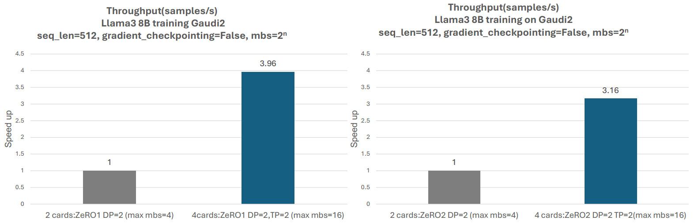
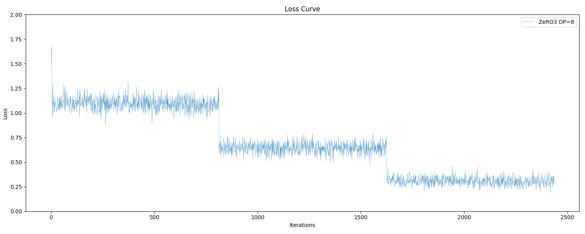
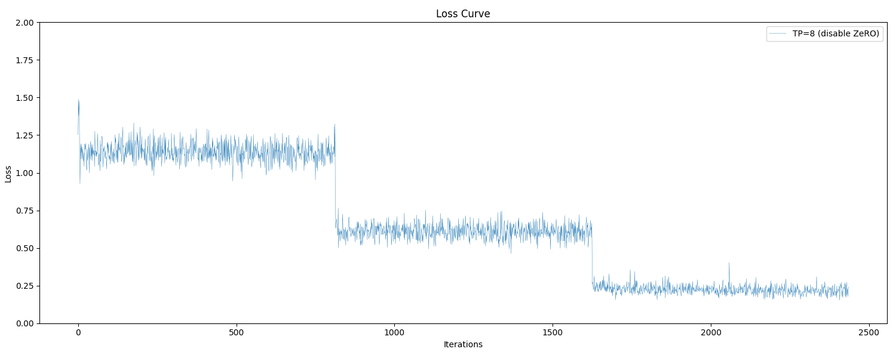
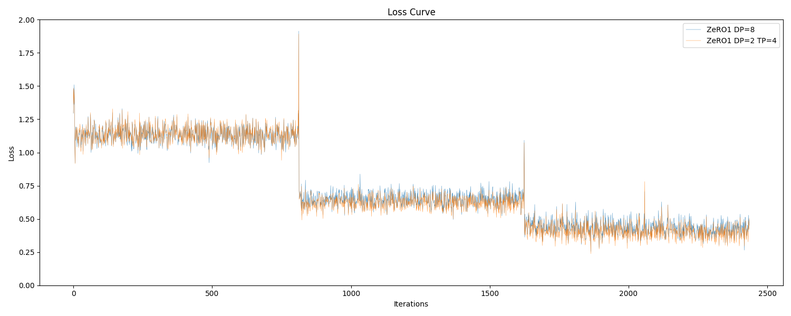
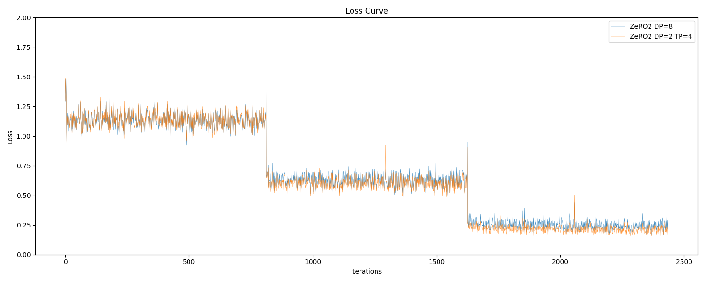
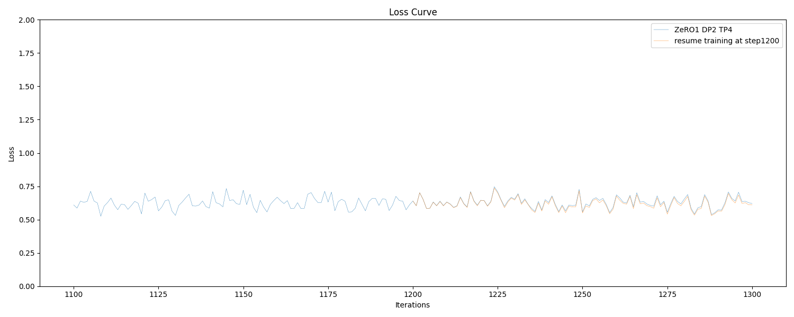
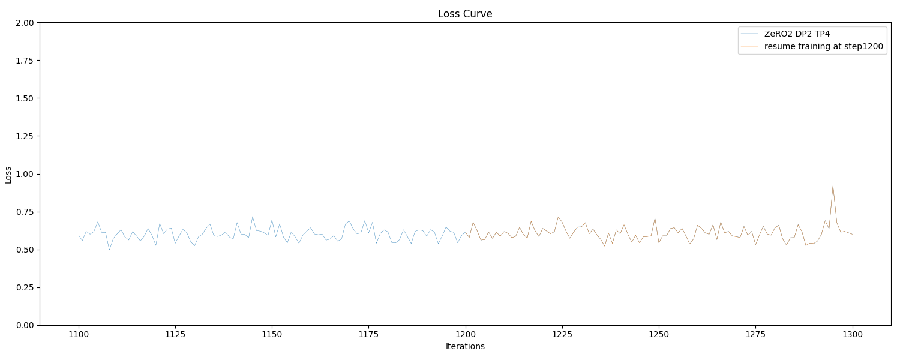

<div align="center">

#  Automatic Tensor Parallel (AutoTP) Training of Hugging Face models

</div>


# Introduction

Tensor parallelism (TP) is an important memory optimization for training large-scale deep learning models. Despite the popularity of training Hugging Face (HF) [models](https://huggingface.co/models), the model scaling options for **[HF trainer](https://huggingface.co/docs/transformers/main_classes/trainer)** was previously limited to sharded data parallelism through [ZeRO](https://huggingface.co/docs/accelerate/usage_guides/deepspeed)/[FSDP](https://huggingface.co/docs/accelerate/usage_guides/fsdp). While ZeRO3 offers superior memory efficiency, it incurs significant communication costs. ZeRO (1/2) has lower communication overhead, but in the case of very large models, it cannot be used directly due to memory limitations. Therefore, combining TP with ZeRO (1/2) offers more balanced options for memory and performance. Moreover, through TP, we can alleviate the batch scaling limitations imposed by ZeRO/FSDP.

We are pleased to announce that DeepSpeed now provides native automatic tensor parallel training for Hugging Face (HF) transformers. This new feature builds on DeepSpeed's [AutoTP](https://www.deepspeed.ai/tutorials/automatic-tensor-parallelism/) mechanism, which was previously restricted to inference. AutoTP training can be combined with ZeRO to unlock unprecented efficiency benefits for HF model post-training, including:

**1**. Model scaling with lower communication costs than FSDP/ZeRO3 (e.g., use AutoTP + ZeRO1 to achieve ZeRO3 memory savings).

**2**. Batch size scaling for faster training and increased throughput.

**3**. Context length scaling to enable new application scenarios.

We have integrated AutoTP training with ZeRO1 & ZeRO2, with ZeRO3 integration on the way. AutoTP training is available in DeepSpeed versions >= 0.16.4

# Batch Scaling with AutoTP Training + ZeRO
The following is a batch scaling experiment of Llama3 8B training conducted on [Gaudi2 Accelerator](https://www.intel.com/content/www/us/en/products/details/processors/ai-accelerators/gaudi.html).


<div align="center">




*Figure 1. Batch scaling experiment on Gaudi2, showing throughput performance improvements from 2 to 4 cards by combining AutoTP and ZeRO. The used mbs is the max possible value with the given config. A higher speedup indicates better performance.*

</div>


<div align="center">


*Figure 2. Model training with AutoTP + ZeRO*

</div>


Figure 2 illustrates the basic flowchart, The division of TP and ZeRO is implemented through the AutoTP parser and ZeRO Wrapper in [Accelerate](https://github.com/huggingface/accelerate.git). Besides, The TP-based dataloader and save mechanism are both supported in DeepSpeed and Accelerate.

# Usage


Although we evaluated AutoTP training with Llama2 & Llama3 models in this blog, we expect compatibility with other Hugging Face models, especially [those](https://www.deepspeed.ai/tutorials/automatic-tensor-parallelism/) previously validated with AutoTP inference.

**Requirements**
- `deepspeed >= 0.16.4`
- `transformers >= 4.50.1`
- `accelerate >= 1.6.0`

 **Enable TP training**

Similar to ZeRO, AutoTP training is enabled using the [deepspeed configuration file](https://www.deepspeed.ai/docs/config-json/) by specifying ```[tensor_parallel][autotp_size]```.
```
    "ZeRO_optimization": {
      "stage": 1,
      "gather_16bit_weights_on_model_save": true,
      ...
    },
    "tensor_parallel":{
      "autotp_size": 4
    },
```

The parallel configuration follows this logic:


```
tp_size = auto_tp_size
dp_size = num_gpus / tp_size
```

Note that the global_batch_size (gbs) changes with different TP settings:
```
gbs (only dp) = per_device_batch_size * n_gpus * gradient_accumulation_steps

gbs (dp with tp) = per_device_batch_size * n_gpus / tp_size * gradient_accumulation_steps
```


 **Save Model**


Saving checkpoints and model files is fully compatible with HF transformers. The [trainer.save_model()](https://huggingface.co/docs/transformers/v4.49.0/en/main_classes/trainer#transformers.Trainer.save_model) method saves the original model. Ensure ```gather_16bit_weights_on_model_save``` is set to ```true```in the [deepspeed configuration file](https://www.deepspeed.ai/docs/config-json/).
```gather_16bit_weights_on_model_save=true in config.
    "ZeRO_optimization": {
      ...
      "gather_16bit_weights_on_model_save": true,
    },
```

```
trainer.save_model(your_saved_path)
```
Models saved this way can be directly used for HF format inference without intermediate transformations.


 **Saving Checkpoints and Resuming**


Saving Checkpoints remains compatible with HF transformers. Use [trainer.save_state()](https://huggingface.co/docs/transformers/v4.49.0/en/main_classes/trainer#transformers.Trainer.save_state) or set the save interval for automatic saving, which can be used to resume training.
```
trainer.train(resume_from_checkpoint="your_saved_path/checkpoint-1200")
```

# Example
We validated AutoTP training using supervised finetune training (SFT) task: [stanford_alpaca](https://github.com/tatsu-lab/stanford_alpaca). The original benchmark model used in this project is Llama2-7B. The example code is also available [here](https://github.com/deepspeedai/DeepSpeedExamples/tree/master/training/tensor_parallel)


**Training Loss curve**


The following loss curves depict SFT training, where gbs is uniformly set to 32, and other configurations match the default experiment settings from ([stanford_alpaca](https://github.com/tatsu-lab/stanford_alpaca)). The loss curves are largely consistent across the following setups:

 - ZeRO3
 - TP + disable ZeRO
 - ZeRO1 and ZeRO1 + AutoTP
 - ZeRO2 and ZeRO2 + AutoTP


<div align="center">




*Figure 3. Loss curve of ZeRO3 stage training (gbs=32, dp=8)*

</div>
<div align="center">



*Figure 4. Loss curve of AutoTP training (gbs=32, tp=8)*
</div>

<div align="center">



*Figure 5. Loss curve of AutoTP + ZeRO1 training (gbs=32, dp=2, tp=4)*
</div>


<div align="center">



*Figure 6. Loss curve of AutoTP + ZeRO2 training (gbs=32, dp=2, tp=4)*


</div>


 **Resuming Training**


  We tested recovery training curves from step 1200 in AutoTP + ZeRO1 and AutoTP + ZeRO2, which align with the original training curves.

<div align="center">



*Figure 7. AutoTP + ZeRO1 resuming training*



*Figure 8. AutoTP + ZeRO2 resuming training*

</div>


 **Model Evaluation**


  We conducted inference evaluations for the [MMLU task](https://github.com/EleutherAI/lm-evaluation-harness).
  In MMLU, the scores for AutoTP + ZeRO1 and ZeRO1, as well as AutoTP + ZeRO2 and ZeRO2, are consistent, showing a fixed improvement over the pre-training model before SFT.


<div align="center">


| Groups | Version | Filter | n-shot | Metric | Model before SFT | ZeRO1 DP8 training | ZeRO1 TP4 DP2 training | ZeRO2 DP8 training | ZeRO2 TP4DP2 training |
|--------|---------|--------|--------|--------|-----------------------|--------------------|------------------------|--------------------|------------------------|
| mmlu | 2 | none | | acc | 0.4185 ± 0.0041 | 0.4472 ± 0.0041 | 0.4444 ± 0.0041 | 0.4543 ± 0.0041 | 0.4529 ± 0.0041 |
| - humanities | 2 | none | | acc | 0.3979 ± 0.0069 | 0.4185 ± 0.0070 | 0.4145 ± 0.0069 | 0.4274 ± 0.0070 | 0.4272 ± 0.0070 |
| - other | 2 | none | | acc | 0.4712 ± 0.0089 | 0.5249 ± 0.0087 | 0.5182 ± 0.0088 | 0.5282 ± 0.0087 | 0.5269 ± 0.0087 |
| - social sciences | 2 | none | | acc | 0.4742 ± 0.0089 | 0.5070 ± 0.0089 | 0.5083 ± 0.0088 | 0.5151 ± 0.0088 | 0.5115 ± 0.0089 |
| - stem | 2 | none | | acc | 0.3428 ± 0.0084 | 0.3549 ± 0.0084 | 0.3539 ± 0.0084 | 0.3622 ± 0.0084 | 0.3609 ± 0.0084 |

*Table 1. MMLU score with Llama2-7B inference*

</div>


# Miscellaneous

If users define their own dataloader, please ensure data consistency within ```deepspeed.utils.groups.get_tensor_model_parallel_group()```. DeepSpeed provides basic validation functions to assist with this.

Furthermore, if users are not using transformers library, you can replace the ```TensorParallel_Layer``` layer and its subclasses as needed. See ```prepare_tp_model``` function in ```unit/model_parallelism/test_autotp_training.py```. Users can also define different shard and gather for subclasses of ```TensorParallel_Layer.```


# Ongoing Work
- **Optimization**: Communication/Activation optimization.
- **Usability**: Support [Transformers TP plan](https://github.com/huggingface/transformers/blob/336dc69d63d56f232a183a3e7f52790429b871ef/src/transformers/models/llama/configuration_llama.py#L145), decouple AutoTP parser and more model testing,


Theoretically, features supported by ZeRO should also be supported, though extensive testing is pending.

Welcome bug reports, enhancement, and additional model training examples.


# Contributors
This work was made possible through a deep collaboration between Intel and Microsoft. The contributors include Mingzhi Liu, Guokai Ma, Kiefer Kuah, Yejing Lai, Kurt Chen, Yejun Guo, Guangxin Xu, Xiaofei Feng, and Yang Wang from Intel; Guanhua Wang and Olatunji Ruwase from Microsoft.
